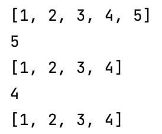

# Practice 3: Collections 

## 1. Stack by Array
TestCase:
`StackByArray<Integer> stack = new StackByArray<>();
stack.push(1);
stack.push(2);
stack.push(3);
stack.push(4);
stack.push(5);
System.out.println(stack);
System.out.println(stack.pop());
System.out.println(stack);
System.out.println(stack.peek());
System.out.println(stack);`

Output:

## 2. Merge Two Sorted Lists 
https://leetcode.com/problems/merge-two-sorted-lists/

## 3. Palindrome LL 
https://leetcode.com/problems/palindrome-linked-list/submissions/

## 4. Adj Duplicates 
https://leetcode.com/problems/remove-all-adjacent-duplicates-in-string/
## 5. Middle Of The LL 
https://leetcode.com/problems/middle-of-the-linked-list/description/