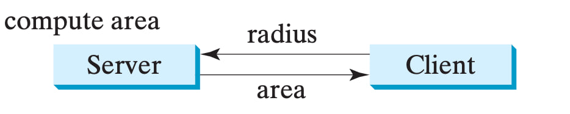
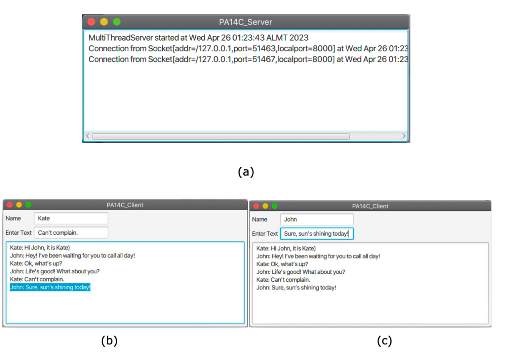

# Practice 5: Multithreading & Networks

## Compute Area of Circle

The client sends the radius to the server; the server computes the area and sends it to the client.

## PA 14 Multiple Clients Chat
Write a program that enables any number of  clients to chat. 
Implement one server that serves all the clients

