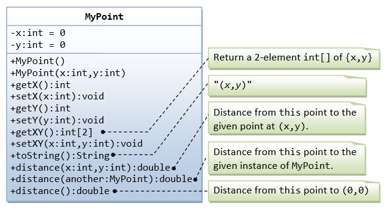
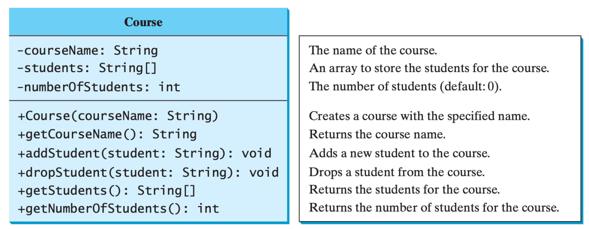

# OOP & Exception Handling

## Problem 1: My Point Implementation

## Problem 2: Course Class (Class Work)

## Problem 3: Password Validator

Напишите метод, который принимает String password и проверяет данный пароль по критериям ниже:
- Пароль должен содержать от 8 до 16 
- В нем должно быть как минимум одна заглавная, одна прописная буква
- Пароль должен содержать как минимум 1 цифру и 1 специальным символ (/@#$^*-!)

Если пароль не подходит по данным критериям, отобразите в консоли сообщение об ошибке InvalidPasswordFormatException. Пользователь должен иметь возможность вводить новый пароль до тех пор, пока пароль не будет подходить по всем критериям.

## Problem 4: MyPoint with Exception Handling
Добавьте в ранее имплементированнй класс MyPoint проверку на вводимый тип х и у в конструкторе и в сеттерах и выведите ошибку InputMismatchException с сообщением о неправильном типе координат
